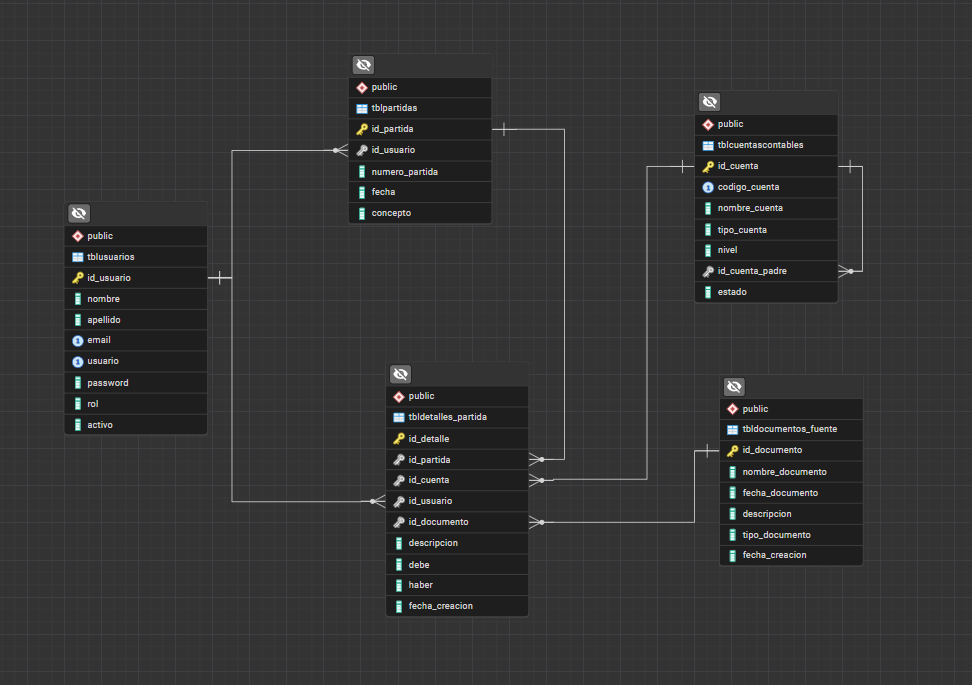

# 📘 Aurum Finance

## 🧾 Descripción General

**Aurum Finance** es un **sistema contable** desarrollado en **JavaFX** que permite **gestionar usuarios, registrar transacciones contables, generar reportes financieros** y **consultar auditorías** de manera segura, intuitiva y eficiente.  

Este sistema está orientado a **contadores, administradores y auditores**, brindando una plataforma moderna que optimiza los procesos contables y facilita la toma de decisiones mediante reportes automatizados y una interfaz gráfica profesional.

---

## ⚙️ Requisitos Previos

Antes de ejecutar el proyecto, asegúrate de cumplir con los siguientes requisitos técnicos:

| Requisito | Versión mínima | Descripción |
|------------|----------------|--------------|
| **Java JDK** | 17 o superior | Requerido para compilar y ejecutar el proyecto. |
| **Maven** | 3.8+ | Herramienta para la gestión de dependencias y empaquetado. |
| **JavaFX SDK** | 17+ | Librerías utilizadas para la interfaz gráfica. |
| **PostgreSQL** | 15 o superior | Sistema de gestión de base de datos utilizado por el sistema. |
| **IDE recomendado** | IntelliJ IDEA / NetBeans / VS Code (con extensión Java) | Para una ejecución y depuración más cómoda. |

---

## 🗄️ Configuración de la Base de Datos

Restaurar base de datos exportada (.backup) desde pgAdmin 4

1. Abre pgAdmin 4  
   Inicia pgAdmin 4 y conéctate a tu servidor de PostgreSQL (introduce tu contraseña si la solicita).

2. Crea una nueva base de datos vacía  
   Esto es importante, para restaurar el contenido dentro de una base de datos nueva.  
   -  En el panel de la izquierda, haz clic derecho sobre “Bases de datos”.  
   -  Selecciona “Crear → Base de datos…”  
   -  En el campo Nombre, escribe “aurum_financeDB”.  
   -  Haz clic en Guardar (o Guardar / Save).

3. Selecciona la base creada para restaurar  
   -  Clic derecho sobre “aurum_financeDB”.  
   -  Selecciona “Restaurar…” (o “Restore…”).

4. Configura la restauración  
   Se abrirá una ventana con opciones de restauración.  
   - Nombre del archivo: selecciona tu archivo de respaldo.  
   - Formato: debe ser Custom.  
   - Número de trabajos: dejarlo vacío.  
   - Nombre de rol: selecciona postgres.  

5. Presiona Restaurar

---

## Estructura de la Base de Datos

La siguiente imagen muestra el **modelo entidad-relación (ERD)** de la base de datos utilizada por **Aurum Finance**, donde se representan las principales tablas y sus relaciones.

  

---
## Variables de Entorno

Aurum Finance requiere variables de entorno para conectarse correctamente a la base de datos PostgreSQL.  
Configúralas antes de ejecutar la aplicación en el archivo **ConexionDB** ubicado en la carpeta **Conexion**.

- private static final String URL = "jdbc:postgresql://localhost:5432/aurum_financedb";
- private static final String USER = "postgres";
- private static final String PASS = "--TucontraseñaServisor--";

## Autores

Nombres:
- Jasson Amilcar Sanchez Perez
- Fatima Arely Cruz Marquez
- Víctor Manuel González Barrera

## Información del Proyecto
- Proyecto: Aurum Finance
- Lenguaje: Java
- Framework: JavaFX
- Base de Datos: PostgreSQL
- Versión: 1.0.0

#    Usuarios de prueba
### Administrador
- Usuarios: admin
- Contraseña: 123456
### Contador
- Usuario: contador
- Contraseña: 123456
